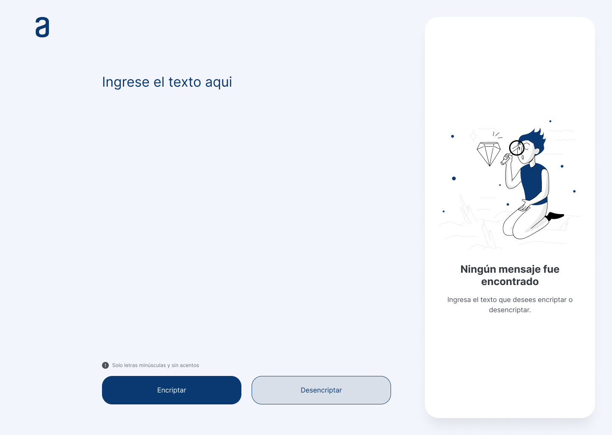
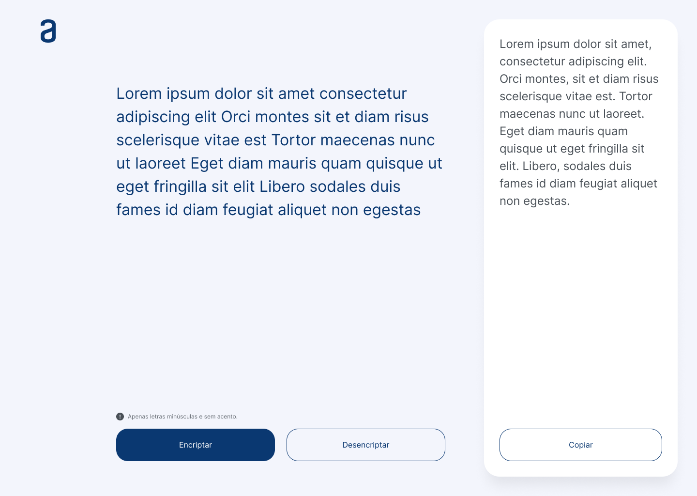
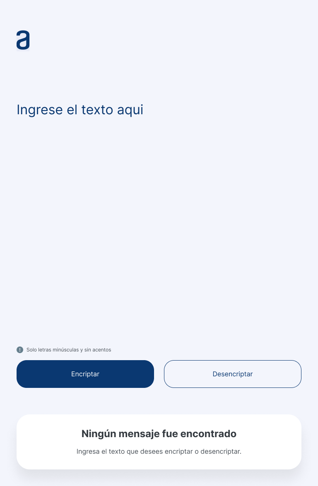
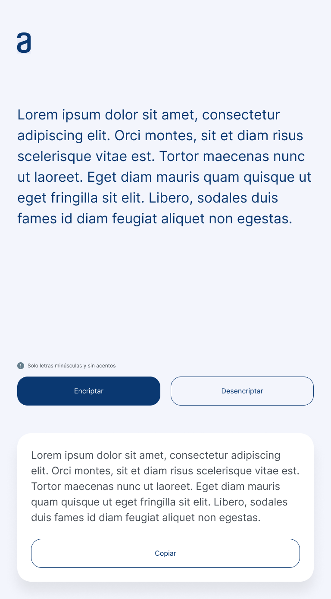
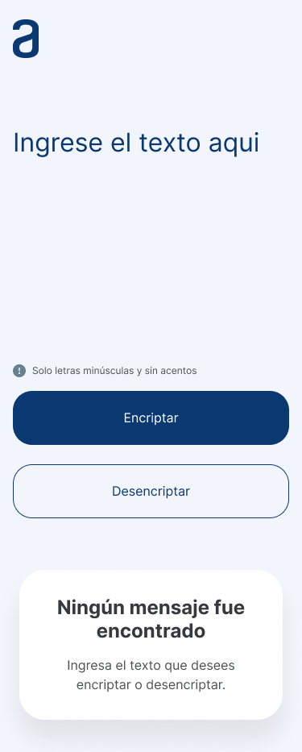
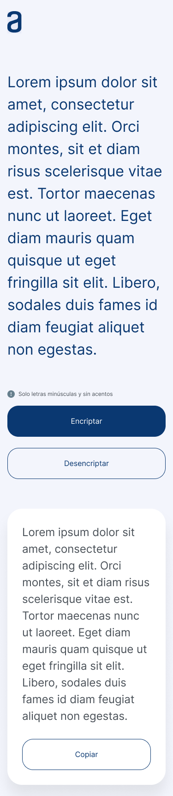

<center><h1>Proyecto reto Alura - ONE</h1></center>

## 🕵️‍♂️Encriptador/Desencriptador de textos 🕵️‍♂️

### **Descripción**

El proyecto consiste en el desarrollo de una aplicación que encripta (y desencripta) textos, con lo que se podrán intercambiar mensajes "secretos" con otros ususarios que conozcan la secuencia/proceso de la encriptación utilizada.  

Las "claves" de encriptación que se emplearan son las siguientes:

```powershell
La letra "e" es convertida para "enter"
La letra "i" es convertida para "imes"
La letra "a" es convertida para "ai"
La letra "o" es convertida para "ober"
La letra "u" es convertida para "ufat"
```
### **Requisitos**

- Debe funcionar sólo con letras minúsculas
- No deben ser utilizadas letras con acentos ni caractéres especiales
- Debe ser posible convertir una palabra para la versión encriptada así como devolver una palabra encriptada a su versión original  

*Por ejemplo*
```powershell
"gato" resulta en: "gaitober"
"gaitober" resulta en: "gato"
```
* La página debe tener campos para la inserción de texto que será encriptado o desencriptado y el usuario debe poder escoger entre una de las dos opciones.
* El resultado debe ser mostrado en pantalla.  

### **Material de apoyo**

Existe un diseño previo con los detalles generales para el desarrollo de la aplicación, este puede servir como plantilla pero existe la libertad de realizar las modificaciones que se crean pertinentes o desarrollar un diseño propio, siempre y cuando se cumpla con los objetivos de la aplicación.

El uso de tecnologías para este proyecto contempla:
* HTML
* CSS
* JavaScript
* Git
* Figma  

Pudiendo complementar con tecnologías/lenguajes que se crean pertinentes.  

Los diseños propuestos para este proyecto son los siguientes:  

  

  

  

  

  

  

### **Extras**

> Un botón que copie el texto encriptado/desencriptado para la sección de transferencias, es decir, que tenga la misma funcionalidad que el uso de `Ctrl + c` o de la opción *`"copiar"`* del menu de las aplicaciones.  

> Publicación de sitio web. Se requiere la publicación del sitio web mediante la implementación del servicio ***Github Pages*** para compartir los resultados en un entorno de ejecución real.

### **Reto**
Desencriptar el siguiente mensaje secreto:
```powershell
fenterlimescimesdaidenters poberr enternfrenterntair enterstenter dentersaifimesober y haibenterrlober cobernclufatimesdober cobern enterximestober!
```